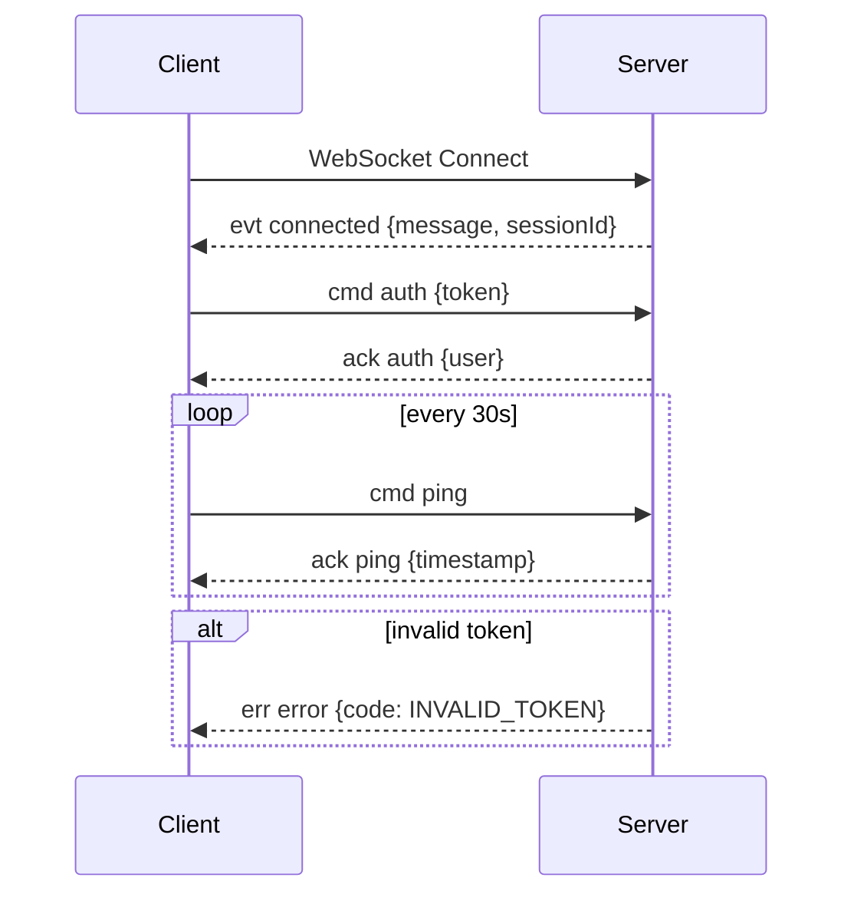
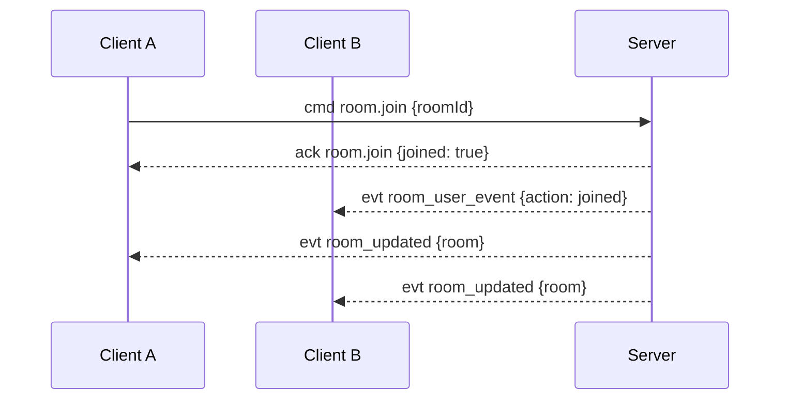
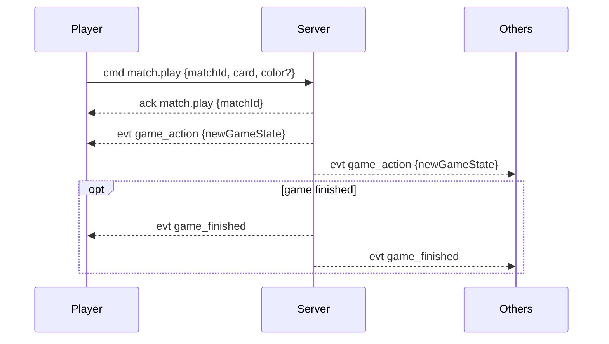
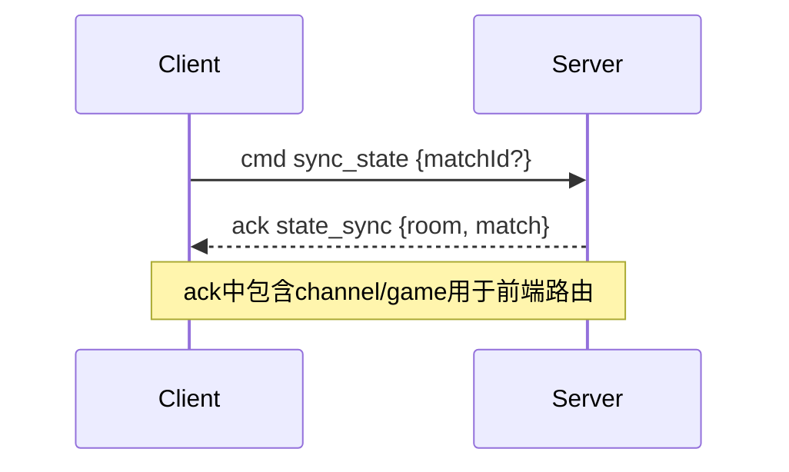

# 棋牌游戏后端 API 和 WebSocket 文档

## 概述

本文档描述了棋牌游戏后端的完整 API 接口和 WebSocket 通信协议。后端采用 Spring Boot 构建，提供 RESTful HTTP API 和实时 WebSocket 通信。

### 基础信息

- **服务地址**: `http://localhost:50000` (开发环境: `http://localhost:50001`)
- **WebSocket 地址**: `ws://localhost:50000/ws` (开发环境: `ws://localhost:50001/ws`)
- **认证方式**: Bearer Token
- **数据格式**: JSON

---

## HTTP API 接口

### 通用响应格式

所有 HTTP API 都使用统一的响应格式：

```json
{
  "success": true,
  "message": "操作成功",
  "data": { /* 具体数据 */ }
}
```

错误响应：
```json
{
  "success": false,
  "message": "错误信息",
  "data": null
}
```

### 端点对照清单（按模块）

- 认证
  - `POST /api/register`
  - `POST /api/login`
  - `POST /api/logout`
  - `POST /api/profile`
  - `GET /api/me`
- 游戏
  - `GET /api/games`
- 房间
  - `GET /api/rooms`
  - `POST /api/rooms`
  - `DELETE /api/rooms/{id}/disband`
- UNO（返回原始 JSON）
  - `POST /api/uno/rooms/{roomId}/start`
  - `GET /api/uno/matches/{id}`
- 管理员
  - `POST /api/admin/invite-codes`
  - `GET /api/admin/invite-codes`
  - `GET /api/admin/invite-codes/stats`
  - `GET /api/admin/users`
  - `GET /api/admin/users/stats`
  - `POST /api/admin/users`
  - `PUT /api/admin/users/{id}/role`
  - `PUT /api/admin/users/{id}/password`
  - `DELETE /api/admin/users/{id}`
  - `GET /api/admin/audit-logs`
  - `GET /api/admin/rooms`
  - `GET /api/admin/rooms/stats`
  - `DELETE /api/admin/rooms/{id}`
  - `GET /api/admin/memory/stats`
  - `GET /api/admin/memory/active-games`
  - `POST /api/admin/memory/gc`
  - `POST /api/admin/memory/cleanup`

### 认证与令牌规范

- HTTP：需要登录的接口在请求头携带 `Authorization: Bearer <session_token>`。
- WebSocket：连接建立后，客户端需发送命令 `{"kind":"cmd","type":"auth","data":{"token":"<session_token>"}}` 进行认证；成功返回 `kind=ack`、`type=auth`，失败返回 `kind=err`、`type=error`（如 `INVALID_TOKEN`、`AUTH_REQUIRED`）。
- UNO 专属接口返回原始 JSON（非 `ApiResponse`），其余接口统一返回 `ApiResponse`。
- 建议前端在持久化层统一管理 `session_token`，HTTP 与 WebSocket 共用同一令牌。

### 认证相关 API

#### 1. 用户注册
```http
POST /api/register
Content-Type: application/json

{
  "username": "player1",
  "password": "password123",
  "displayName": "玩家一",
  "inviteCode": "ABC123"
}
```

#### 2. 用户登录
```http
POST /api/login
Content-Type: application/json

{
  "username": "player1",
  "password": "password123"
}
```

响应：
```json
{
  "success": true,
  "data": {
    "session_token": "eyJhbGciOiJIUzI1NiIsInR5cCI6IkpXVCJ9...",
    "user": {
      "id": 1,
      "username": "player1",
      "displayName": "玩家一",
      "role": "user"
    }
  }
}
```

#### 3. 获取当前用户信息
```http
GET /api/me
Authorization: Bearer <token>
```

#### 4. 更新个人信息
```http
POST /api/profile
Authorization: Bearer <token>
Content-Type: application/json

{
  "displayName": "新昵称"
}
```

### 游戏相关 API

#### 1. 获取游戏列表
```http
GET /api/games
```

响应：
```json
{
  "success": true,
  "data": [
    {
      "code": "uno",
      "name": "UNO",
      "minPlayers": 2,
      "maxPlayers": 8
    }
  ]
}
```

### 房间相关 API

#### 1. 获取房间列表
```http
GET /api/rooms
```

#### 2. 创建房间
```http
POST /api/rooms
Authorization: Bearer <token>
Content-Type: application/json

{
  "name": "我的房间",
  "gameCode": "uno",
  "maxPlayers": 4,
  "isPrivate": false,
  "password": "可选密码"
}
```

#### 3. 加入房间
（通过 WebSocket 实现）

说明：加入房间通过 WebSocket 命令 `room.join` 完成，HTTP 不提供此端点。请参见下文“房间相关命令”。

#### 4. 离开房间
（通过 WebSocket 实现）

说明：离开房间通过 WebSocket 命令 `room.leave` 完成，HTTP 不提供此端点。请参见下文“房间相关命令”。

#### 5. 设置准备状态
（通过 WebSocket 实现）

说明：准备状态通过 WebSocket 命令 `room.ready` 完成，HTTP 不提供此端点。请参见下文“房间相关命令”。

#### 6. 解散房间（房主）
```http
DELETE /api/rooms/{roomId}/disband
Authorization: Bearer <token>
```

### UNO 游戏 API

#### 1. 开始游戏（房主）
```http
POST /api/uno/rooms/{roomId}/start
Authorization: Bearer <token>
```

#### 2. 查看游戏状态
```http
GET /api/uno/matches/{matchId}
Authorization: Bearer <token>
```

### 管理员 API

#### 1. 创建邀请码
```http
POST /api/admin/invite-codes
Authorization: Bearer <admin_token>
Content-Type: application/json

{
  "count": 10,
  "batchNo": "BATCH_001",
  "expiresDays": 30
}
```

#### 2. 查询邀请码列表
```http
GET /api/admin/invite-codes?page=1&size=20&status=unused&batchNo=BATCH_001
Authorization: Bearer <admin_token>
```

#### 3. 用户管理
```http
GET /api/admin/users?page=1&size=20&role=user&search=username
Authorization: Bearer <admin_token>
```

#### 4. 房间管理
```http
GET /api/admin/rooms?page=1&size=20&status=waiting&gameCode=uno
Authorization: Bearer <admin_token>
```

#### 5. 删除房间（管理员）
```http
DELETE /api/admin/rooms/{roomId}
Authorization: Bearer <admin_token>
```

#### 6. 内存状态监控
```http
GET /api/admin/memory/stats
Authorization: Bearer <admin_token>
```

响应：
```json
{
  "success": true,
  "data": {
    "gameState": {
      "activeGames": 150,
      "activeRooms": 80,
      "totalOnlinePlayers": 320,
      "estimatedMemoryUsage": 245760,
      "estimatedMemoryUsageMB": 0.23,
      "maxActiveGames": 1000,
      "maxMemoryMB": 100,
      "memoryUsagePercent": 0.23,
      "gameCountPercent": 15.0,
      "gamesByType": {
        "uno": 150
      }
    },
    "webSocket": {
      "onlineUsers": 320
    },
    "jvm": {
      "totalMemory": 536870912,
      "freeMemory": 234567890,
      "usedMemory": 302303022,
      "maxMemory": 2147483648,
      "availableProcessors": 8
    }
  }
}
```

#### 7. 获取活跃游戏统计
```http
GET /api/admin/memory/active-games
Authorization: Bearer <admin_token>
```

#### 8. 强制垃圾回收（调试用）
```http
POST /api/admin/memory/gc
Authorization: Bearer <admin_token>
```

---

## WebSocket 通信协议

### 连接和认证

1. **建立连接**
```javascript
// 生产环境
const ws = new WebSocket('ws://localhost:50000/ws');
// 开发环境
const ws = new WebSocket('ws://localhost:50001/ws');
```

服务端连接成功事件：
```json
{
  "kind": "evt",
  "type": "connected",
  "data": {
    "message": "连接成功，请发送认证信息",
    "sessionId": "<websocket_session_id>"
  }
}
```

2. **认证**
```json
{
  "kind": "cmd",
  "type": "auth",
  "cid": "auth_001",
  "data": {
    "token": "your_bearer_token"
  }
}
```

认证成功响应：
```json
{
  "kind": "ack",
  "type": "auth",
  "cid": "auth_001",
  "data": {
    "userId": 1,
    "username": "player1",
    "displayName": "玩家一",
    "role": "user"
  }
}
```

### 消息格式

#### 统一 Envelope 结构
```json
{
  "kind": "cmd|evt|ack|err",
  "type": "消息类型",
  "cid": "客户端请求ID（用于关联请求和响应）",
  "data": { /* 消息数据 */ },
  "timestamp": "2024-01-15T10:30:00Z",
  "messageId": "msg_12345",
  "channel": "频道名称（如 room:uno:123）",
  "game": "游戏代码（如 uno）"
}
```

#### 消息类型说明
- **cmd**: 客户端发送的命令
- **evt**: 服务器推送的事件
- **ack**: 服务器对命令的确认响应
- **err**: 错误消息

#### 频道命名规范
- 房间频道：`room:<gameCode>:<roomId>`（示例：`room:uno:123`）
- 对局频道：`match:<gameCode>:<matchId>`（示例：`match:uno:456`）
- 游戏代码使用小写（如 `uno`），事件中通常包含 `channel` 与 `game` 字段，便于前端过滤与路由。

#### 兼容与确认规则
- 若客户端未携带 `kind` 字段，服务器将按命令处理（默认 `cmd`）。
- 若未提供 `cid`，服务器会使用 `messageId` 回传并作为 `cid`，以便前端关联请求与响应。
- 确认响应（`ack`）的 `type` 通常与命令类型一致；旧类型会被标准化（例如 `join_room` → `room.join`、`play_card` → `match.play`）。
- 例外：`sync_state` 的确认类型为 `state_sync`（用于区分请求与响应）。

### 房间相关命令

#### 1. 加入房间
```json
{
  "kind": "cmd",
  "type": "room.join",
  "cid": "join_001",
  "data": {
    "roomId": 123
  }
}
```

加入房间确认响应：
```json
{
  "kind": "ack",
  "type": "room.join",
  "cid": "join_001",
  "data": {
    "roomId": 123,
    "joined": true
  }
}
```

#### 2. 离开房间
```json
{
  "kind": "cmd",
  "type": "room.leave",
  "cid": "leave_001",
  "data": {
    "roomId": 123
  }
}
```

离开房间确认响应：
```json
{
  "kind": "ack",
  "type": "room.leave",
  "cid": "leave_001",
  "data": {
    "roomId": 123,
    "left": true
  }
}
```

#### 3. 设置准备状态
```json
{
  "kind": "cmd",
  "type": "room.ready",
  "cid": "ready_001",
  "data": {
    "roomId": 123,
    "ready": true
  }
}
```

设置准备状态确认响应：
```json
{
  "kind": "ack",
  "type": "room.ready",
  "cid": "ready_001",
  "data": {
    "roomId": 123,
    "ready": true
  }
}
```

### 游戏相关命令

#### 1. 出牌
```json
{
  "kind": "cmd",
  "type": "match.play",
  "cid": "play_001",
  "data": {
    "matchId": 456,
    "card": "R-5",
    "color": "B"
  }
}
```
说明：当 `card` 为 `W-WILD` 或 `W-D4` 时，必须提供 `color`（`R|G|B|Y`）。

出牌确认响应：
```json
{
  "kind": "ack",
  "type": "match.play",
  "cid": "play_001",
  "data": {
    "matchId": 456
  }
}
```

#### 2. 摸牌
```json
{
  "kind": "cmd",
  "type": "match.draw",
  "cid": "draw_001",
  "data": {
    "matchId": 456
  }
}
```

摸牌确认响应：
```json
{
  "kind": "ack",
  "type": "match.draw",
  "cid": "draw_001",
  "data": {
    "matchId": 456
  }
}
```

### 状态同步

#### 同步请求
```json
{
  "kind": "cmd",
  "type": "sync_state",
  "cid": "sync_001",
  "data": {
    "matchId": 456
  }
}
```

#### 同步响应
```json
{
  "kind": "ack",
  "type": "state_sync",
  "cid": "sync_001",
  "channel": "match:uno:456",
  "game": "uno",
  "data": {
    "room": {
      "id": 123,
      "name": "我的房间",
      "status": "playing",
      "players": [...]
    },
    "match": {
      "currentIdx": 0,
      "direction": 1,
      "pendingDraw": 0,
      "forcedColor": null,
      "top": "R-4",
      "players": [
        {"userId": 1, "handCount": 7, "hand": ["B-SKIP","R-1","Y-4","Y-8","Y-1"]},
        {"userId": 4, "handCount": 10}
      ]
    }
  }
}
```

### 服务器推送事件

#### 1. 房间更新
```json
{
  "kind": "evt",
  "type": "room_updated",
  "channel": "room:uno:123",
  "game": "uno",
  "data": {
    "roomId": 123,
    "room": {
      "id": 123,
      "name": "我的房间",
      "status": "waiting",
      "maxPlayers": 4,
      "gameCode": "uno",
      "players": [...]
    }
  }
}
```

#### 2. 用户加入/离开房间
```json
{
  "kind": "evt",
  "type": "room_user_event",
  "channel": "room:uno:123",
  "game": "uno",
  "data": {
    "roomId": 123,
    "user": {
      "userId": 2,
      "username": "player2",
      "displayName": "玩家二"
    },
    "action": "joined"
  }
}
```

#### 3. 房间解散相关事件
```json
// 房间即将解散
{
  "kind": "evt",
  "type": "room_disbanding",
  "channel": "room:uno:123",
  "game": "uno",
  "data": {
    "roomId": 123,
    "initiatedBy": {
      "userId": 1,
      "username": "owner",
      "displayName": "房主"
    },
    "reason": "房主解散房间"
  }
}

// 被踢出房间
{
  "kind": "evt",
  "type": "room_kicked",
  "channel": "room:uno:123",
  "game": "uno",
  "data": {
    "roomId": 123,
    "reason": "房间已解散"
  }
}

// 房间已解散
{
  "kind": "evt",
  "type": "room_disbanded",
  "channel": "room:uno:123",
  "game": "uno",
  "data": {
    "roomId": 123
  }
}
```

#### 4. 游戏开始
```json
{
  "kind": "evt",
  "type": "game_started",
  "channel": "match:uno:456",
  "game": "uno",
  "data": {
    "roomId": 123,
    "matchId": 456,
    "gameState": {
      "currentIdx": 0,
      "direction": 1,
      "pendingDraw": 0,
      "forcedColor": null,
      "top": "R-5",
      "players": [
        {"userId": 1, "handCount": 7, "hand": ["R-1","G-3","Y-8"]},
        {"userId": 2, "handCount": 7}
      ],
      "started": true,
      "finished": false,
      "winnerUserId": null
    }
  }
}
```

#### 5. 游戏操作
```json
{
  "kind": "evt",
  "type": "game_action",
  "channel": "match:uno:456",
  "game": "uno",
  "data": {
    "matchId": 456,
    "action": "play_card",
    "player": {
      "userId": 1,
      "username": "player1",
      "displayName": "玩家一"
    },
    "actionData": {
      "card": "R-5",
      "chosenColor": "B"
    },
    "newGameState": {
      "currentIdx": 1,
      "direction": 1,
      "pendingDraw": 0,
      "forcedColor": null,
      "top": "R-5",
      "players": [
        {"userId": 1, "handCount": 6, "hand": ["B-SKIP","R-1","Y-4","Y-8","Y-1"]},
        {"userId": 2, "handCount": 7}
      ]
    }
  }
}
```

#### 6. 游戏结束
```json
{
  "kind": "evt",
  "type": "game_finished",
  "channel": "match:uno:456",
  "game": "uno",
  "data": {
    "matchId": 456,
    "status": "finished",
    "endedAt": "2024-01-15T11:00:00Z"
  }
}
```

### 心跳机制

#### 心跳请求
```json
{
  "kind": "cmd",
  "type": "ping",
  "cid": "ping_001"
}
```

#### 心跳响应
```json
{
  "kind": "ack",
  "type": "ping",
  "cid": "ping_001",
  "data": {
    "timestamp": 1705312200000
  }
}
```

### 错误处理

#### 错误响应格式
```json
{
  "kind": "err",
  "type": "error",
  "cid": "request_id",
  "data": {
    "code": "AUTH_REQUIRED",
    "message": "请先进行认证"
  }
}
```

#### 常见错误码
- `INVALID_KIND`: 仅接收 kind=cmd 的命令消息
- `MISSING_TYPE`: 缺少消息类型
- `UNKNOWN_MESSAGE_TYPE`: 未知消息类型
- `INVALID_TOKEN`: 令牌无效或已过期
- `AUTH_REQUIRED`: 需要认证
- `JOIN_ROOM_ERROR`: 加入房间参数错误
- `LEAVE_ROOM_ERROR`: 离开房间参数错误
- `ROOM_READY_ERROR`: 设置准备状态参数错误
- `PLAY_CARD_FAILED`: 出牌失败（规则校验失败等）
- `DRAW_CARD_FAILED`: 摸牌失败（不在你回合等）
- `SYNC_FAILED`: 状态同步失败
- `ROUTE_ERROR`: 消息路由失败
- `MESSAGE_PARSE_ERROR`: 消息解析失败
- `SERIALIZATION_ERROR`: 消息序列化失败（服务端内部）

---

## Mermaid 交互与数据流图

### 1. WebSocket 认证与心跳


### 2. 房间加入与状态广播


### 3. UNO 出牌与动作广播


### 4. 状态同步


## 前端集成指南

### 1. 环境配置

#### JavaScript/TypeScript
```bash
npm install ws
# 或者在浏览器中直接使用 WebSocket API
```

#### Flutter/Dart
```yaml
dependencies:
  web_socket_channel: ^2.4.0
  http: ^1.1.0
```

### 2. HTTP 客户端封装

#### JavaScript 示例
```javascript
class ApiClient {
  constructor(baseUrl = 'http://localhost:50000') { // 生产环境，开发环境使用 http://localhost:50001
    this.baseUrl = baseUrl;
    this.token = localStorage.getItem('auth_token');
  }

  async request(method, path, data = null) {
    const headers = {
      'Content-Type': 'application/json',
    };
    
    if (this.token) {
      headers['Authorization'] = `Bearer ${this.token}`;
    }

    const response = await fetch(`${this.baseUrl}${path}`, {
      method,
      headers,
      body: data ? JSON.stringify(data) : null,
    });

    const result = await response.json();
    
    if (!result.success) {
      throw new Error(result.message);
    }
    
    return result.data;
  }

  // 认证相关
  async login(username, password) {
    const result = await this.request('POST', '/api/login', { username, password });
    this.token = result.session_token;
    localStorage.setItem('auth_token', this.token);
    return result;
  }

  async register(username, password, displayName, inviteCode) {
    return this.request('POST', '/api/register', {
      username, password, displayName, inviteCode
    });
  }

  // 房间相关
  async getRooms() {
    return this.request('GET', '/api/rooms');
  }

  async createRoom(name, gameCode, maxPlayers, isPrivate = false, password = null) {
    return this.request('POST', '/api/rooms', {
      name, gameCode, maxPlayers, isPrivate, password
    });
  }

  async joinRoom(roomId, password = null) {
    return this.request('POST', `/api/rooms/${roomId}/join`, { password });
  }

  async leaveRoom(roomId) {
    return this.request('POST', `/api/rooms/${roomId}/leave`);
  }

  async setReady(roomId, ready) {
    return this.request('POST', `/api/rooms/${roomId}/ready`, { ready });
  }

  // UNO 游戏相关
  async startGame(roomId) {
    return this.request('POST', `/api/uno/rooms/${roomId}/start`);
  }

  async getGameState(matchId) {
    return this.request('GET', `/api/uno/matches/${matchId}`);
  }
}

### 2. WebSocket 客户端封装（示例）
```javascript
class WsClient {
  constructor(token) {
    this.token = token;
    this.ws = null;
  }
  connect() {
    const url = process.env.NODE_ENV === 'production' ? 'wss://boardgame.techox.cc/ws' : 'ws://localhost:50001/ws';
    this.ws = new WebSocket(url);
    this.ws.onopen = () => this.auth();
    this.ws.onmessage = (ev) => this.onMessage(JSON.parse(ev.data));
  }
  send(type, data = {}, cid = undefined) {
    const msg = { kind: 'cmd', type, data };
    if (cid) msg.cid = cid;
    this.ws.send(JSON.stringify(msg));
  }
  auth() { this.send('auth', { token: this.token }, 'auth_1'); }
  joinRoom(roomId) { this.send('room.join', { roomId }, 'join_1'); }
  leaveRoom(roomId) { this.send('room.leave', { roomId }, 'leave_1'); }
  setReady(roomId, ready) { this.send('room.ready', { roomId, ready }, 'ready_1'); }
  play(matchId, card, color) { this.send('match.play', { matchId, card, color }, 'play_1'); }
  draw(matchId) { this.send('match.draw', { matchId }, 'draw_1'); }
  syncState(matchId) { this.send('sync_state', { matchId }, 'sync_1'); }
}
```
```

### 3. WebSocket 客户端封装

#### JavaScript 示例
```javascript
class GameWebSocket {
  constructor(url = 'ws://localhost:50000/ws') { // 生产环境，开发环境使用 ws://localhost:50001/ws
    this.url = url;
    this.ws = null;
    this.token = localStorage.getItem('auth_token');
    this.messageId = 0;
    this.pendingRequests = new Map();
    this.eventHandlers = new Map();
  }

  connect() {
    return new Promise((resolve, reject) => {
      this.ws = new WebSocket(this.url);
      
      this.ws.onopen = () => {
        console.log('WebSocket 连接成功');
        this.authenticate().then(resolve).catch(reject);
      };

      this.ws.onmessage = (event) => {
        this.handleMessage(JSON.parse(event.data));
      };

      this.ws.onclose = (event) => {
        console.log('WebSocket 连接关闭:', event.code, event.reason);
      };

      this.ws.onerror = (error) => {
        console.error('WebSocket 错误:', error);
        reject(error);
      };
    });
  }

  async authenticate() {
    if (!this.token) {
      throw new Error('未找到认证令牌');
    }

    return this.sendCommand('auth', { token: this.token });
  }

  sendCommand(type, data = {}) {
    return new Promise((resolve, reject) => {
      const cid = `cmd_${++this.messageId}`;
      const message = {
        kind: 'cmd',
        type,
        cid,
        data,
        timestamp: new Date().toISOString()
      };

      this.pendingRequests.set(cid, { resolve, reject });
      this.ws.send(JSON.stringify(message));

      // 设置超时
      setTimeout(() => {
        if (this.pendingRequests.has(cid)) {
          this.pendingRequests.delete(cid);
          reject(new Error('请求超时'));
        }
      }, 10000);
    });
  }

  handleMessage(message) {
    const { kind, type, cid, data } = message;

    if (kind === 'ack' && cid && this.pendingRequests.has(cid)) {
      const { resolve } = this.pendingRequests.get(cid);
      this.pendingRequests.delete(cid);
      resolve(data);
    } else if (kind === 'err' && cid && this.pendingRequests.has(cid)) {
      const { reject } = this.pendingRequests.get(cid);
      this.pendingRequests.delete(cid);
      reject(new Error(data.message || '未知错误'));
    } else if (kind === 'evt') {
      this.handleEvent(type, data, message);
    }
  }

  handleEvent(type, data, fullMessage) {
    const handlers = this.eventHandlers.get(type) || [];
    handlers.forEach(handler => {
      try {
        handler(data, fullMessage);
      } catch (error) {
        console.error(`事件处理器错误 (${type}):`, error);
      }
    });
  }

  on(eventType, handler) {
    if (!this.eventHandlers.has(eventType)) {
      this.eventHandlers.set(eventType, []);
    }
    this.eventHandlers.get(eventType).push(handler);
  }

  off(eventType, handler) {
    const handlers = this.eventHandlers.get(eventType);
    if (handlers) {
      const index = handlers.indexOf(handler);
      if (index > -1) {
        handlers.splice(index, 1);
      }
    }
  }

  // 房间相关方法
  async joinRoom(roomId) {
    return this.sendCommand('room.join', { roomId });
  }

  async leaveRoom(roomId) {
    return this.sendCommand('room.leave', { roomId });
  }

  async setReady(roomId, ready) {
    return this.sendCommand('room.ready', { roomId, ready });
  }

  // 游戏相关方法
  async playCard(matchId, card, color = null) {
    return this.sendCommand('match.play', { matchId, card, color });
  }

  async drawCard(matchId) {
    return this.sendCommand('match.draw', { matchId });
  }

  async syncState(matchId = null) {
    return this.sendCommand('sync_state', { matchId });
  }

  // 心跳
  async ping() {
    return this.sendCommand('ping');
  }

  disconnect() {
    if (this.ws) {
      this.ws.close();
      this.ws = null;
    }
  }
}
```

### 4. 使用示例

#### 完整的游戏客户端示例
```javascript
class GameClient {
  constructor() {
    this.api = new ApiClient();
    this.ws = new GameWebSocket();
    this.currentRoom = null;
    this.currentMatch = null;
  }

  async initialize() {
    // 建立 WebSocket 连接
    await this.ws.connect();

    // 设置事件监听
    this.setupEventHandlers();

    // 启动心跳
    this.startHeartbeat();
  }

  setupEventHandlers() {
    // 房间更新
    this.ws.on('room_updated', (data) => {
      this.currentRoom = data.room;
      this.onRoomUpdated(data.room);
    });

    // 用户加入/离开
    this.ws.on('room_user_event', (data) => {
      this.onUserEvent(data.user, data.action);
    });

    // 游戏开始
    this.ws.on('game_started', (data) => {
      this.currentMatch = data.matchId;
      this.onGameStarted(data.gameState);
    });

    // 游戏操作
    this.ws.on('game_action', (data) => {
      this.onGameAction(data.action, data.player, data.actionData, data.newGameState);
    });

    // 游戏结束
    this.ws.on('game_finished', (data) => {
      this.onGameFinished(data);
    });

    // 房间解散
    this.ws.on('room_disbanding', (data) => {
      this.onRoomDisbanding(data);
    });

    this.ws.on('room_kicked', (data) => {
      this.onRoomKicked(data.reason);
    });

    this.ws.on('room_disbanded', (data) => {
      this.currentRoom = null;
      this.currentMatch = null;
      this.onRoomDisbanded();
    });
  }

  startHeartbeat() {
    setInterval(async () => {
      try {
        await this.ws.ping();
      } catch (error) {
        console.error('心跳失败:', error);
      }
    }, 30000);
  }

  // 游戏流程方法
  async createAndJoinRoom(name, gameCode, maxPlayers) {
    // 通过 HTTP API 创建房间
    const room = await this.api.createRoom(name, gameCode, maxPlayers);
    
    // 通过 WebSocket 加入房间
    await this.ws.joinRoom(room.id);
    
    this.currentRoom = room;
    return room;
  }

  async joinExistingRoom(roomId, password = null) {
    // 通过 HTTP API 加入房间
    await this.api.joinRoom(roomId, password);
    
    // 通过 WebSocket 加入房间
    await this.ws.joinRoom(roomId);
  }

  async setReady(ready) {
    if (!this.currentRoom) return;
    
    // 可以选择使用 HTTP API 或 WebSocket
    await this.ws.setReady(this.currentRoom.id, ready);
  }

  async startGame() {
    if (!this.currentRoom) return;
    
    // 通过 HTTP API 开始游戏
    const result = await this.api.startGame(this.currentRoom.id);
    this.currentMatch = result.matchId;
    return result;
  }

  async playCard(card, color = null) {
    if (!this.currentMatch) return;
    
    return this.ws.playCard(this.currentMatch, card, color);
  }

  async drawCard() {
    if (!this.currentMatch) return;
    
    return this.ws.drawCard(this.currentMatch);
  }

  // 事件回调方法（需要在 UI 层实现）
  onRoomUpdated(room) {
    console.log('房间更新:', room);
  }

  onUserEvent(user, action) {
    console.log(`用户 ${user.displayName} ${action === 'joined' ? '加入' : '离开'}了房间`);
  }

  onGameStarted(gameState) {
    console.log('游戏开始:', gameState);
  }

  onGameAction(action, player, actionData, newGameState) {
    console.log(`玩家 ${player.displayName} 执行了 ${action}:`, actionData);
  }

  onGameFinished(data) {
    console.log('游戏结束:', data);
  }

  onRoomDisbanding(data) {
    console.log('房间即将解散:', data);
  }

  onRoomKicked(reason) {
    console.log('被踢出房间:', reason);
  }

  onRoomDisbanded() {
    console.log('房间已解散');
  }
}
```

### 5. 错误处理建议

#### 网络错误处理
```javascript
class ErrorHandler {
  static handleApiError(error) {
    if (error.message.includes('网络')) {
      // 网络连接问题
      return '网络连接失败，请检查网络设置';
    } else if (error.message.includes('令牌')) {
      // 认证问题
      localStorage.removeItem('auth_token');
      window.location.href = '/login';
      return '登录已过期，请重新登录';
    } else {
      // 其他业务错误
      return error.message;
    }
  }

  static handleWebSocketError(error) {
    console.error('WebSocket 错误:', error);
    // 可以实现重连逻辑
    setTimeout(() => {
      // 重新连接
    }, 5000);
  }
}
```

#### 重连机制
```javascript
class ReconnectManager {
  constructor(gameClient) {
    this.gameClient = gameClient;
    this.reconnectAttempts = 0;
    this.maxReconnectAttempts = 5;
    this.reconnectDelay = 1000;
  }

  async attemptReconnect() {
    if (this.reconnectAttempts >= this.maxReconnectAttempts) {
      console.error('重连次数已达上限');
      return false;
    }

    this.reconnectAttempts++;
    console.log(`尝试重连 (${this.reconnectAttempts}/${this.maxReconnectAttempts})`);

    try {
      await this.gameClient.initialize();
      
      // 重连成功后恢复状态
      if (this.gameClient.currentRoom) {
        await this.gameClient.ws.joinRoom(this.gameClient.currentRoom.id);
        await this.gameClient.ws.syncState(this.gameClient.currentMatch);
      }

      this.reconnectAttempts = 0;
      return true;
    } catch (error) {
      console.error('重连失败:', error);
      
      // 指数退避
      const delay = this.reconnectDelay * Math.pow(2, this.reconnectAttempts - 1);
      setTimeout(() => this.attemptReconnect(), delay);
      
      return false;
    }
  }
}
```

### 6. 开发调试

#### 测试工具
可以使用提供的 `websocket_test.html` 文件进行 WebSocket 连接测试：

1. 打开 `file:///path/to/websocket_test.html`
2. 点击"连接"按钮
3. 获取登录 token 并进行认证
4. 测试各种命令和事件

#### 日志记录
建议在开发过程中启用详细的日志记录：

```javascript
class Logger {
  static debug(message, data = null) {
    if (process.env.NODE_ENV === 'development') {
      console.log(`[DEBUG] ${message}`, data);
    }
  }

  static info(message, data = null) {
    console.log(`[INFO] ${message}`, data);
  }

  static error(message, error = null) {
    console.error(`[ERROR] ${message}`, error);
  }
}
```

---

## 总结

本文档提供了完整的后端 API 和 WebSocket 通信协议说明，以及详细的前端集成指南。主要特点：

1. **统一的消息格式**: 使用 Envelope 结构统一所有 WebSocket 消息
2. **清晰的错误处理**: 提供详细的错误码和错误信息
3. **实时通信**: 通过 WebSocket 实现房间状态同步和游戏操作
4. **RESTful API**: 提供标准的 HTTP API 用于基础操作
5. **完整的示例**: 包含前端集成的完整代码示例
6. **优化的数据库设计**: 高频数据存储在内存中，提升性能

### 数据库优化说明

为了提升性能，我们对数据库进行了重大优化：

#### 🚀 **内存状态管理**
- **游戏状态**: 所有活跃游戏的状态数据存储在内存中，避免频繁的数据库读写
- **房间玩家状态**: 玩家的准备状态、座位号、活跃时间等存储在内存中
- **自动清理**: 定时清理过期的内存状态，防止内存泄漏

#### 📊 **数据库结构优化**
- **移除高频更新字段**: `Match.stateJson`、`RoomPlayer.ready`、`RoomPlayer.lastActiveAt` 等
- **添加索引**: 为所有常用查询字段添加数据库索引
- **简化动作记录**: 只记录重要的游戏里程碑事件，不记录每个游戏动作
- **数据分离**: 热数据（频繁访问）和冷数据（历史记录）分离存储

#### 🔧 **性能提升**
- **减少数据库压力**: 游戏操作不再需要数据库写入
- **提升响应速度**: 内存访问比数据库访问快数百倍
- **降低延迟**: WebSocket 消息处理更加快速
- **支持更多并发**: 可以支持更多同时在线的游戏

#### 📈 **监控和管理**
- **内存统计接口**: `/api/admin/memory/stats` 查看内存使用情况
- **活跃游戏监控**: 实时监控活跃游戏和在线玩家数量
- **自动清理机制**: 定时清理过期状态，保持内存使用稳定

### 迁移指南

1. **执行数据库迁移**: 运行 `database_migration.sql` 脚本
2. **重启应用**: 使新的内存管理和文件数据加载生效
3. **验证配置**: 确保 `gamedata/` 和 `i18n/` 目录下的JSON文件正确加载
4. **监控性能**: 使用管理员接口监控内存使用情况
5. **测试功能**: 确保所有游戏功能正常工作

### 配置文件说明

#### 游戏数据文件
- `src/main/resources/gamedata/uno_cards.json` - UNO卡牌定义
- `src/main/resources/gamedata/uno_config.json` - UNO游戏规则配置
- `src/main/resources/i18n/uno_zh_CN.json` - 中文本地化文本

#### 内存管理配置
```java
// 在 GameStateManager 中可调整的参数
MAX_ACTIVE_GAMES = 1000;        // 最大同时游戏数
MAX_MEMORY_MB = 100;            // 最大内存使用限制
EXPIRE_HOURS = 2;               // 状态过期时间
CLEANUP_INTERVAL_MINUTES = 5;   // 清理间隔
```

### 开发指南

#### 添加新游戏
1. 在 `gamedata/` 目录添加新游戏的卡牌和配置文件
2. 在 `i18n/` 目录添加本地化文本
3. 在 `GameDataManager.loadGameData()` 中添加加载逻辑
4. 实现对应的游戏引擎类

#### 修改游戏规则
1. 直接编辑 `gamedata/` 目录下的JSON配置文件
2. 调用 `/api/admin/reload-config` 接口热重载（如果实现）
3. 或重启应用使配置生效

开发者可以根据这个文档快速集成前端应用，实现完整的多人在线棋牌游戏功能。新的架构设计能够支持更大规模的并发用户和更流畅的游戏体验。