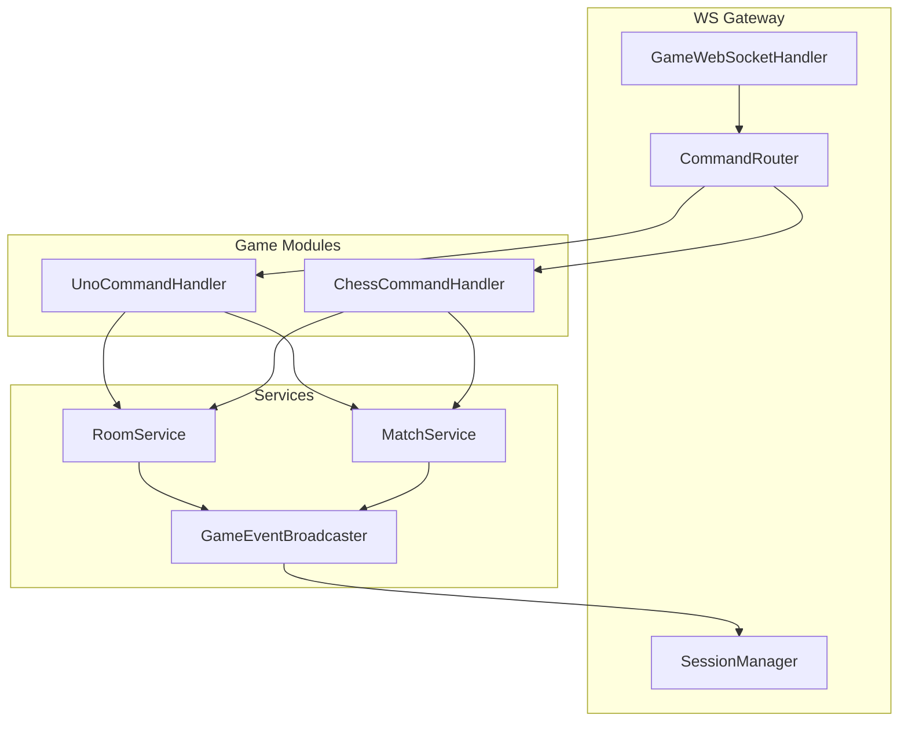
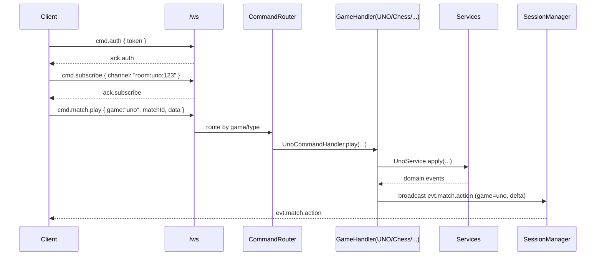
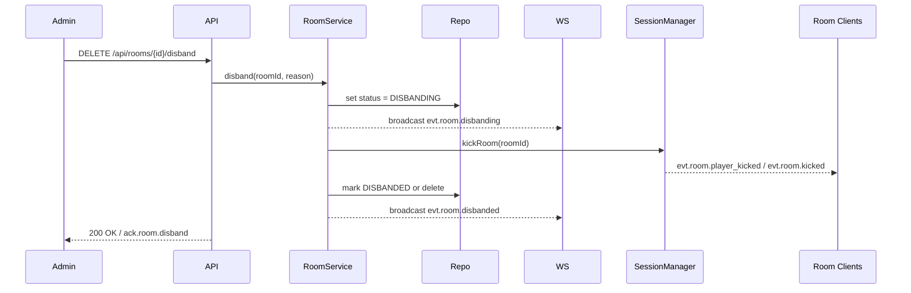
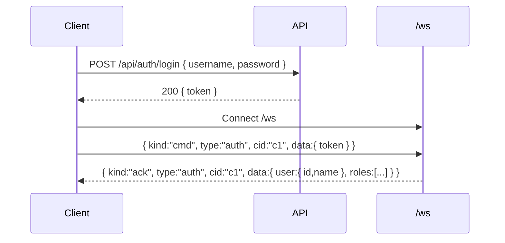
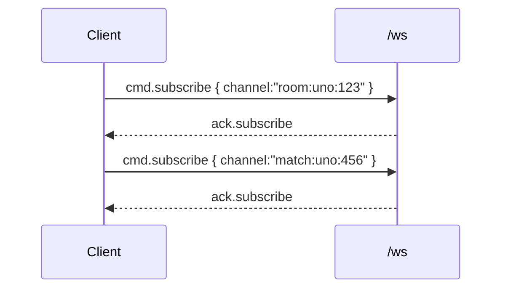
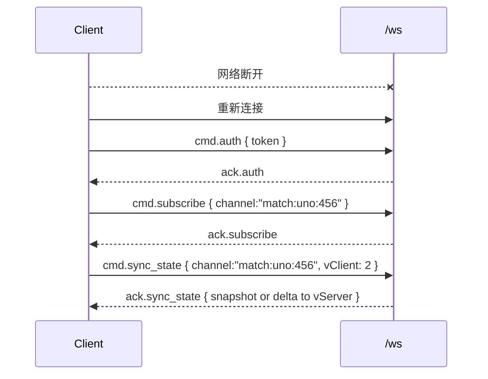
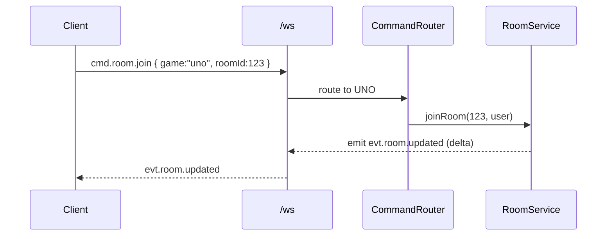

# Boardgame 平台架构与接口说明

本文件按两个维度组织：
- 前端指导书：连接与鉴权、订阅、房间与对局操作、断线重连与错误处理（含时序图与请求/响应示例）。
- 后端接口说明书：HTTP 与 WS 的接口规范、Envelope、错误码与通道命名（含请求/响应示例）。
- 多游戏文件结构与网络结构：模块分层与路由规范（插件式）。
- 房间解散操作顺序与通知：服务端执行顺序与事件广播。

## 客户端改造要点
- WebSocket 客户端统一通过 `cmd.*` 发起动作，等待 `ack.*`；订阅所需频道后被动接收 `evt.*`。
- 维护本地 `version` 与 `lastMessageId`，断线后发送 `cmd.sync_state` 拉取缺失 delta 或快照。
- 仍可使用 HTTP 获取低频列表（如 `/api/games`、`/api/rooms`），减少实时态的轮询。

## 分阶段迁移计划
1) Phase 0（骨架）：为 WS 增加命令路由与 `ack/err`，实现 `subscribe/unsubscribe`；保持 REST 不变。
2) Phase 1（动作切换）：前端将房间与对局动作迁移到 WS；启用心跳超时主动关闭；精简重复 HTTP 调用。
3) Phase 2（增量推送）：实现 `Delta` 与周期快照；引入基本监控（消息大小、QPS、错误率）。
4) Phase 3（二进制/压缩）：协商 `permessage-deflate`，评估 MessagePack；逐步标注并停用高频 REST。

## 监控与告警
- 指标：在线连接数、消息大小平均/95p、广播次数/每房间、处理延迟、错误率、重连成功率。
- 采集：在 `GameEventBroadcaster` 与 `GameWebSocketHandler` 增加计数器与时延埋点；按房间与对局维度聚合。

## 执行步骤（摘要）
1) 扩展 `GameWebSocketHandler`：加入命令路由、Envelope、`ack/err`；注入 `RoomService`、`UnoService`、`GameEventBroadcaster`。
2) 扩展 `WebSocketSessionManager`：新增订阅表与广播方法；完善超时关闭逻辑。
3) 在 `GameEventBroadcaster` 增加 Delta 生成器与快照策略；统一事件封装。
4) 前端：迁移动作到 WS；实现 `subscribe` 与本地状态合并；保留 HTTP 低频查询。
5) 配置：启用 WS 压缩；生产环境收紧 `allowed-origins`。

—— 以上方案在不大改现有服务的前提下，通过“命令化 WS + 订阅 + 增量更新 + 压缩”四个要点显著降低重复计算与传输体积，同时保持良好的兼容性与演进空间。

## 多游戏（Multi-Game）文件结构与网络结构

为支持不止一款游戏（如 UNO、Chess、Go 等），建议将“通用网关与会话/订阅”与“各游戏的领域逻辑/指令处理”明确分层，采用插件式注册。

### 文件结构（建议）
```text
src/main/java/cc/techox/boardgame/
  common/
    auth/               # 统一认证/令牌解析
    ws/                 # 统一 Envelope/频道/路由/会话
      Envelope.java
      ChannelNames.java
      CommandRouter.java
      WebSocketSessionManager.java
    dto/                # 通用DTO（分页/错误/确认等）
    util/               # 工具方法（序列化/压缩/Patch等）

  core/                 # 与具体游戏无关的通用服务
    room/               # 房间模型与服务
      RoomService.java
      RoomRepo.java
    match/              # 对局生命周期（通用）
      MatchService.java
      MatchRepo.java

  gateway/
    websocket/
      GameWebSocketHandler.java  # 统一WS端点
      WebSocketConfig.java       # WS配置（压缩/跨域）

  games/                # 各游戏的独立模块（插件式）
    uno/
      controller/       # 低频HTTP（只读/列表/管理员）
      service/          # UNO领域服务
      domain/           # UNO领域模型
      ws/
        UnoCommandHandler.java   # WS命令处理（play/draw/start等）
    chess/
      controller/
      service/
      domain/
      ws/
        ChessCommandHandler.java

  admin/
    controller/         # 管理端HTTP与工具接口
```

### 模块注册与路由（核心思想）
- `CommandRouter`：根据 Envelope（`game`、`type`、`scope`）将 WS 命令路由到对应游戏的 `GameCommandHandler`。
- `GameCommandHandler` 接口：各游戏模块实现各自的 `cmd.room.*`、`cmd.match.*` 处理；返回统一 `ack/err`。
- `GameEventBroadcaster`：接受各游戏服务返回的领域事件，封装为统一 `evt.*` Envelope（携带 `game` 字段），并按频道广播。
- `WebSocketSessionManager`：不关心具体游戏，仅负责订阅/广播与用户会话；频道命名约定由 `ChannelNames` 统一。



### 频道命名与消息规范（跨游戏统一）
- Envelope 增加 `game` 字段：`{"game":"uno|chess|go", "kind":"cmd|evt|ack|err", ...}`。
- 频道命名（统一约定）：
  - `lobby`：跨游戏大厅；或按游戏分出 `lobby:{game}`。
  - `room:{game}:{roomId}`：游戏房间频道。
  - `match:{game}:{matchId}`：游戏对局频道。
- 消息类型建议：
  - 命令：`cmd.room.join`、`cmd.room.ready`、`cmd.match.start`、`cmd.match.play`、`cmd.match.draw`（根据游戏扩展具体 `data` 字段）。
  - 事件：`evt.room.updated`（delta）、`evt.match.started`（snapshot）、`evt.match.action`（delta）、`evt.match.finished`。
  - 确认/错误：`ack.*` / `err.*` 保持统一格式；客户端以 `cid` 关联。

### 网络结构（HTTP/WS 分工，跨游戏）
- HTTP：跨游戏的低频接口（列表/统计/只读）与管理员操作。
  - `GET /api/games`（游戏列表/元信息）
  - `GET /api/{game}/rooms`、`POST /api/{game}/rooms`、`DELETE /api/{game}/rooms/{id}/disband`
  - `GET /api/{game}/matches/{id}`（历史/复盘）
- WS：各游戏的实时动作与事件流（房间/对局内）。
  - 单端点 `/ws`，携带统一 Envelope 与 `game` 字段。
  - 订阅：`cmd.subscribe { channel: "room:{game}:{roomId}" }`、`cmd.subscribe { channel: "match:{game}:{matchId}" }`。
  - 动作：由各游戏的 `GameCommandHandler` 处理，统一返回 `ack/err`，并由 `GameEventBroadcaster` 广播 `evt.*`。



### 新增游戏的接入步骤（一次性工作）
1) 在 `games/{newGame}/` 新建 `domain/ service/ ws/ controller/` 子模块。
2) 实现 `GameCommandHandler` 接口（各命令：房间/对局动作）。
3) 在启动时向 `CommandRouter` 注册 `{gameKey -> GameCommandHandler}`。
4) 复用 `RoomService/MatchService`（或在必要处扩展），在 `GameEventBroadcaster` 生成通用 `evt.*`。
5) HTTP 仅实现低频接口（房间列表/详情/解散/统计），实时动作走 WS。


## 房间解散（Disband Room）操作顺序与通知

推荐由管理员通过 HTTP 触发（`DELETE /api/rooms/{id}/disband`），服务端统一执行有序步骤与 WS 广播；也可保留管理员 WS 命令 `cmd.room.disband`（两者走同一服务方法）。

- 顺序建议（单步立即解散，简单可靠）：
  - 获取房间锁，读取当前状态，避免并发加入/操作。
  - 将房间状态持久化为 `DISBANDING`，阻止新加入与后续动作。
  - WS 广播 `evt.room.disbanding { roomId, reason, initiatedBy, effectiveAt }`，通知所有订阅者即将解散。
  - 通过 `SessionManager.kickRoom(roomId)` 强制移除房内所有玩家（从订阅表与房间映射移除），可附带逐个 `evt.room.player_kicked`（或一次性 `evt.room.kicked`）。
  - 若对局仍在进行，发布 `evt.match.aborted { roomId, matchId, reason }` 并执行必要的终止与结算回滚。
  - 最终将房间标记为 `DISBANDED` 或执行硬删除（根据产品策略，推荐软删除以保留审计），更新索引与缓存。
  - WS 广播 `evt.room.disbanded { roomId }`，同步 `lobby`/`admin` 频道的房间列表。
  - 返回 HTTP `200 OK`（或 WS `ack.room.disband`）。

- 关键点与理由：
  - “先标记再广播再踢人再删除”：先持久化 `DISBANDING` 防止竞态（例如解散与新用户加入同时发生）。
  - 广播在前，确保客户端收到“即将关闭”的语义，再被动接收踢出与最终关闭事件，体验更友好。
  - 服务端强制移除，不依赖客户端主动离开，保证一致性与资源清理。
  - 软删除更易审计与复盘；硬删除需确认对运维与合规的影响。



- 两阶段（可选，更温和）：
  - Phase A（软关）：状态置为 `DISBANDING`，广播 `evt.room.disbanding`，设置倒计时（如 5–10 秒），允许客户端保存状态与提示。
  - Phase B（硬删）：倒计时结束后 `kickRoom`，标记 `DISBANDED` 或删除，并广播 `evt.room.disbanded`。

- 并发与幂等：
  - 幂等键：`roomId` + `disbandedAt`；重复调用直接返回当前终态与不重复广播。
  - 加入/动作在 `DISBANDING/DISBANDED` 阶段统一拒绝（`err.room.closed`）。
  - 事件去重：为广播事件附带递增版本 `v` 与 `messageId`，客户端丢弃重复。

- 客户端处理建议：
  - 收到 `evt.room.disbanding` 显示提示并冻结房间内操作；收到 `evt.room.kicked` 即跳转到大厅或上层页面；收到 `evt.room.disbanded` 刷新房间列表。

## 前端指导书（Frontend Guide）

### 1) 连接与鉴权
- 步骤：
  - 使用 HTTP 登录获取 `token`；然后建立 WS 连接并发送 `cmd.auth`。
- 时序图：

- 示例：
```json
// 请求（WS）
{ "kind":"cmd", "type":"auth", "cid":"c1", "data":{ "token":"Bearer x.y.z" } }
// 响应
{ "kind":"ack", "type":"auth", "cid":"c1", "data":{ "user":{ "id":101, "name":"Alice" } } }
```

### 2) 订阅频道
- 推荐：加入房间后订阅 `room:{game}:{roomId}`；进入对局后再订阅 `match:{game}:{matchId}`。
- 时序图：

- 示例：
```json
{ "kind":"cmd", "type":"subscribe", "cid":"c2", "data":{ "channel":"room:uno:123" } }
{ "kind":"ack", "type":"subscribe", "cid":"c2", "data":{} }
```

### 3) 房间内操作
- 加入房间：
```json
// 请求
{ "kind":"cmd", "type":"room.join", "cid":"c3", "game":"uno", "data":{ "roomId":123 } }
// 确认
{ "kind":"ack", "type":"room.join", "cid":"c3", "data":{ "roomId":123, "joined":true } }
// 事件（delta）
{ "kind":"evt", "type":"room.updated", "game":"uno", "channel":"room:uno:123", "v":12,
  "data":{ "changed":{ "players[2].ready":true } } }
```
- 准备/取消准备：
```json
{ "kind":"cmd", "type":"room.ready", "cid":"c4", "game":"uno", "data":{ "roomId":123, "ready":true } }
{ "kind":"ack", "type":"room.ready", "cid":"c4", "data":{} }
```
- 离开房间：
```json
{ "kind":"cmd", "type":"room.leave", "cid":"c5", "game":"uno", "data":{ "roomId":123 } }
{ "kind":"ack", "type":"room.leave", "cid":"c5", "data":{} }
```

### 4) 对局操作
- 开始对局：
```json
{ "kind":"cmd", "type":"match.start", "cid":"c6", "game":"uno", "data":{ "roomId":123 } }
{ "kind":"ack", "type":"match.start", "cid":"c6", "data":{ "matchId":456 } }
// 事件（快照）
{ "kind":"evt", "type":"match.started", "game":"uno", "channel":"match:uno:456", "v":1,
  "data":{ "snapshot":{ "topCard":"R-3", "players":[{"id":101,"handCount":7}, {"id":202,"handCount":7}], "currentPlayer":101 } } }
```
- 出牌：
```json
{ "kind":"cmd", "type":"match.play", "cid":"c7", "game":"uno", "data":{ "matchId":456, "card":"R-5", "color":null } }
{ "kind":"ack", "type":"match.play", "cid":"c7", "data":{} }
// 事件（delta）
{ "kind":"evt", "type":"match.action", "game":"uno", "channel":"match:uno:456", "v":2,
  "data":{ "changed":{ "topCard":"R-5", "currentPlayer":202 }, "private":{ "userId":101, "handDelta":{"remove":["R-5"], "add":[]} } } }
```
- 摸牌/过牌：
```json
{ "kind":"cmd", "type":"match.draw", "cid":"c8", "game":"uno", "data":{ "matchId":456 } }
{ "kind":"ack", "type":"match.draw", "cid":"c8", "data":{} }
```

### 5) 解散房间的前端处理
- 收到 `evt.room.disbanding`：弹提示、冻结操作。
- 收到 `evt.room.kicked`：跳转到大厅页；取消房间/对局订阅。
- 收到 `evt.room.disbanded`：刷新列表。

### 6) 断线重连与状态同步

- 请求/响应示例：
```json
{ "kind":"cmd", "type":"sync_state", "cid":"c9", "data":{ "channel":"match:uno:456", "vClient":2 } }
{ "kind":"ack", "type":"sync_state", "cid":"c9", "data":{ "snapshot":{ /* 最新完整状态 */ }, "vServer":5 } }
```

### 7) 错误处理
```json
{ "kind":"err", "cid":"c7", "code":"ROOM_CLOSED", "message":"room 123 is closed" }
{ "kind":"err", "cid":"c7", "code":"INVALID_ACTION", "message":"card not playable" }
```

## 后端接口说明书（Backend API）

### HTTP 接口
- `POST /api/auth/login`
  - 请求：`{ "username":"alice", "password":"p@ss" }`
  - 响应：`200 { "token":"Bearer x.y.z", "user":{ "id":101 } }`
  - 失败：`401 { "error":"INVALID_CREDENTIAL" }`

- `GET /api/games`
  - 响应：`200 [{ "key":"uno", "name":"UNO" }, { "key":"chess", "name":"Chess" }]`

- `GET /api/{game}/rooms`
  - 参数：`?page=0&size=20&status=OPEN`
  - 响应：`200 { "items":[{ "id":123, "name":"Fun UNO", "maxPlayers":4, "status":"OPEN" }], "page":0, "size":20, "total":1 }`

- `POST /api/{game}/rooms`
  - 请求：`{ "name":"Fun UNO", "maxPlayers":4 }`
  - 响应：`201 { "id":123 }`

- `DELETE /api/{game}/rooms/{id}/disband`
  - 响应：`200 { "ok":true }`
  - 说明：服务端将按“标记→广播→踢人→删除/标记终态→广播”的顺序执行。

- `GET /api/{game}/matches/{id}`
  - 响应：`200 { "id":456, "snapshot":{ /* 完整对局状态 */ } }`

### WebSocket 接口
- Envelope（统一包裹）：`{ "kind":"cmd|evt|ack|err", "type":"...", "cid":"...", "game":"uno|chess|...", "channel":"...", "v":number, "data":{} }`

- 命令与确认（请求/响应示例）
  - `auth`
    - 请求：`{ kind:"cmd", type:"auth", cid:"c1", data:{ token } }`
    - 确认：`{ kind:"ack", type:"auth", cid:"c1", data:{ user } }`
  - `subscribe`
    - 请求：`{ kind:"cmd", type:"subscribe", cid:"c2", data:{ channel } }`
    - 确认：`{ kind:"ack", type:"subscribe", cid:"c2", data:{} }`
  - `room.join/ready/leave`
    - 请求：`{ kind:"cmd", type:"room.join", cid:"c3", game:"uno", data:{ roomId } }`
    - 确认：`{ kind:"ack", type:"room.join", cid:"c3", data:{ joined:true } }`
  - `match.start/play/draw`
    - 请求：`{ kind:"cmd", type:"match.play", cid:"c7", game:"uno", data:{ matchId, card, color } }`
    - 确认：`{ kind:"ack", type:"match.play", cid:"c7", data:{} }`
  - `sync_state`
    - 请求：`{ kind:"cmd", type:"sync_state", cid:"c9", data:{ channel, vClient } }`
    - 确认：`{ kind:"ack", type:"sync_state", cid:"c9", data:{ snapshot|delta, vServer } }`

- 事件（广播示例）
  - `evt.room.updated`（delta）：`{ kind:"evt", type:"room.updated", game, channel, v, data:{ changed:{...} } }`
  - `evt.match.started`（snapshot）：`{ kind:"evt", type:"match.started", game, channel, v, data:{ snapshot:{...} } }`
  - `evt.match.action`（delta）：`{ kind:"evt", type:"match.action", game, channel, v, data:{ changed:{...}, private:{...} } }`
  - `evt.room.disbanding` / `evt.room.disbanded`

- 错误（统一格式）
  - 示例：`{ kind:"err", cid:"cX", code:"ROOM_CLOSED", message:"..." }`
  - 常见错误码：`UNAUTHENTICATED`、`FORBIDDEN`、`ROOM_NOT_FOUND`、`ROOM_CLOSED`、`INVALID_ACTION`、`MATCH_NOT_FOUND`、`RATE_LIMITED`。

### 关键流程时序图
- 登录与建立 WS：见“前端指导书 1) 连接与鉴权”。
- 加入房间与更新：

- 开始对局与动作：见“前端指导书 4) 对局操作”。
- 断线重连：见“前端指导书 6) 断线重连与状态同步”。