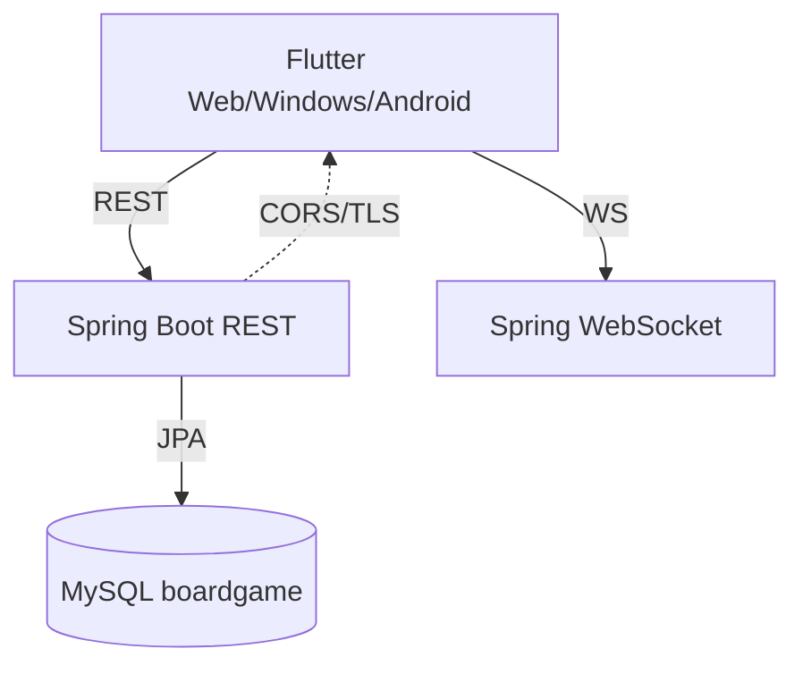
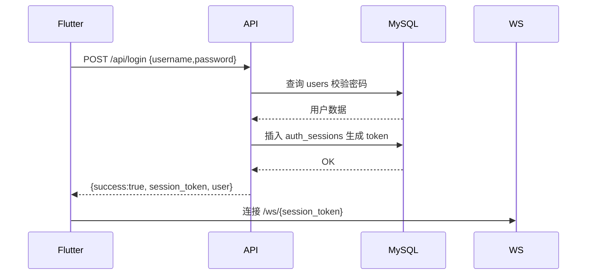
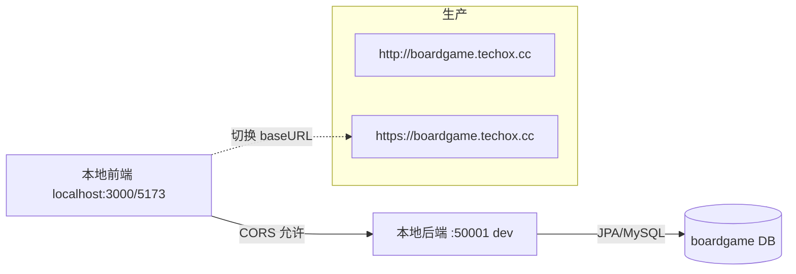

# BoardGame 后端项目书（Spring Boot）

目标：提供与 Flutter 前端对接的 Web 后端（REST + WebSocket），兼容 Web/Windows/Android 前端，连接现有 MySQL 数据库 `boardgame`。

## 一、范围与目标
- 用户注册、登录、注销；基于会话令牌（`auth_sessions`）统一鉴权。
- 游戏列表、房间大厅、房间内准备与开局、对局过程事件（WS）。
- 兼容现有 SQL 结构（见 `sql/schema_boardgame.sql`）。
- 提供本地运行、Docker 部署与生产配置指引。

## 二、技术栈
- Java `17`，Spring Boot `3.x` 
- Spring Web（REST）、Spring WebSocket（原生 JSON，避免过度设计）
- Spring Data JPA（实体映射到已有表），Flyway（可选迁移）
- MySQL 8（`mysql-connector-j`），Jackson（JSON）
- 构建：Maven（推荐）

## 三、系统架构


## 四、数据库与实体映射
沿用 `sql/schema_boardgame.sql` 表结构，核心实体：
- User -> `users`
- AuthSession -> `auth_sessions`
- Game -> `games`
- Room -> `rooms`
- RoomPlayer -> `room_players`
- Match -> `matches`
- MatchAction -> `match_actions`
- ChatMessage -> `chat_messages`

JPA 策略：
- 使用 `@Entity` + `@Table(name="...")`，主键 `@Id`（含自增）、`@GeneratedValue`。
- 外键用 `@ManyToOne(fetch = LAZY)` + `@JoinColumn(name="...")`，必要时用 `@JsonIgnore` 避免循环序列化。
- 密码存储：短期兼容现状（`salt:sha256`），后续迁移 BCrypt；会话令牌保存在 `auth_sessions`。

## 五、API 设计（最小集）
- 统一返回：绝大多数 REST 接口使用 `ApiResponse` 包装：`{"success":boolean, "message":string, "data":any}`。
- 例外：UNO 专属接口返回原始 JSON（不使用 `ApiResponse`），详见“UNO 接口说明（REST）”。

- POST `/api/register`
  - req: `{ "username": string, "password": string, "inviteCode": string }`
  - resp.data: `{ "id": number, "username": string, "displayName": string }`
- POST `/api/login`
  - req: `{ "username": string, "password": string }`
  - resp.data: `{ "session_token": string, "user": { "id": number, "username": string, "displayName": string } }`
- POST `/api/logout`（Header: `Authorization: Bearer {token}`）
  - resp: `{ "success": true, "message": "注销成功", "data": null }`
- GET `/api/games`
  - resp.data: `[{ "code": string, "name": string, "minPlayers": number, "maxPlayers": number }]`
- GET `/api/rooms`
  - resp.data: `[{ "id": number, "name": string, "gameCode": string, "ownerId": number, "status": string, "maxPlayers": number, "isPrivate": boolean, "createdAt": string, "updatedAt": string }]`
- POST `/api/rooms`
  - Header: `Authorization: Bearer {token}`
  - req: `{ "name": string, "gameCode": string, "maxPlayers": number, "isPrivate": boolean, "password"?: string }`
  - resp.data: `RoomInfo`（同上）
- POST `/api/rooms/{id}/join`
  - Header: `Authorization: Bearer {token}`
  - req: `{ "password"?: string }`（仅私房必填）
  - resp: `ok`
- POST `/api/rooms/{id}/leave`
  - Header: `Authorization: Bearer {token}`
  - resp: `ok`
- POST `/api/rooms/{id}/ready`
  - Header: `Authorization: Bearer {token}`
  - req: `{ "ready": boolean }`
  - resp: `ok`
- WS `/ws/{session_token}`（JSON 消息）
  - 事件：`rooms_list`, `room_created`, `room_joined`, `room_updated`, `room_left`, `game_started`, `game_action_result`
  - 说明：当前代码仓库尚未提供 WS 处理器实现（仅依赖已引入），后续迭代补充。

登录时序（示例）：


## 六、鉴权与安全
- Bearer Token：前端以 `Authorization: Bearer {session_token}` 访问受限资源；WS 使用路径令牌。
- 密码：先兼容现有 `salt:sha256`；新注册推荐 `BCrypt`（可通过前后端约定逐步迁移）。
- CORS：生产环境明确允许域名（不可用 `*`）。
- TLS：生产必须使用 HTTPS/WSS。

## 七、配置与部署
环境变量（推荐）/ `application.yml`：
```yaml
server:
  port: 50000
spring:
  datasource:
    url: jdbc:mysql://152.53.165.99:3306/boardgame?useUnicode=true&characterEncoding=utf8&serverTimezone=UTC&useSSL=false
    username: BoardGame
    password: Specialfox233
  jpa:
    hibernate:
      ddl-auto: none
    properties:
      hibernate:
        dialect: org.hibernate.dialect.MySQL8Dialect
        format_sql: false
  flyway:
    enabled: false # 如需启用，见下文
cors:
  allowed-origins: "http://boardgame.techox.cc,https://boardgame.techox.cc"
```

部署方式：
- 本地开发：`mvn spring-boot:run`
- 宝塔面板（最简）：上传 JAR，添加启动命令：`nohup java -jar /www/server/boardgame/boardgame.jar --server.port=50000 &`；Nginx 反代到 `127.0.0.1:50000` 并开启 HTTPS；配置 MySQL 连接即可。

## 八、开发计划（里程碑）
- M1：项目脚手架、基础实体与仓库、`/api/health`
- M2：注册/登录/注销（REST）与会话管理
- M3：游戏与房间 REST，WS 连接与房间事件
- M4：错误码与统一返回、CORS/安全与部署脚本
- M5：测试与灰度上线

## 九、示例串联（真实返回节选）

- 管理员出 `W-WILD` 选红：
```json
{"currentIdx":1,"direction":1,"pendingDraw":0,"forcedColor":"R","top":"W-WILD","players":[{"userId":2,"handCount":5,"hand":["B-SKIP","R-1","Y-4","Y-8","Y-1"]},{"userId":4,"handCount":11}]}
```
- 玩家B 出 `R-4`：
```json
{"currentIdx":0,"direction":1,"pendingDraw":0,"forcedColor":null,"top":"R-4","players":[{"userId":2,"handCount":5},{"userId":4,"handCount":10,"hand":["Y-SKIP","W-D4","Y-7","G-REV","Y-2","Y-8","W-D4","B-7","R-1","B-9"]}]}
```

## 本地开发与测试

- 目标：前端直连本地后端，生产保持 `boardgame.techox.cc` 域名。
- 分环境：已新增 `application-dev.yml` 与 `application-prod.yml`；默认 `application.yml` 保持通用配置。

- 本地运行（开发模式）
  - 使用 Maven：
    - `./mvnw -DskipTests -Dspring-boot.run.profiles=dev spring-boot:run`
  - 使用打包 JAR：
    - `java -jar target/boardgame-0.0.1-SNAPSHOT.jar --spring.profiles.active=dev`
  - 端口：`dev` 配置为 `50001`（见 `application-dev.yml`）。

- 前端联调
  - 本地后端基地址：`http://localhost:50001`
  - 示例（fetch）：
    ```js
    const API = 'http://localhost:50001';
    async function login(username, password){
      const r = await fetch(`${API}/api/login`, {method:'POST', headers:{'Content-Type':'application/json'}, body: JSON.stringify({username, password})});
      const {data} = await r.json();
      return data.session_token;
    }
    async function listGames(token){
      const r = await fetch(`${API}/api/games`, {headers:{'Authorization':`Bearer ${token}`}});
      return (await r.json()).data;
    }
    ```

- CORS 配置
  - dev：`src/main/resources/application-dev.yml`
    - `cors.allowed-origins: "http://localhost:3000,http://127.0.0.1:3000,http://localhost:5173,http://127.0.0.1:5173,http://localhost:8080,http://127.0.0.1:8080"`
    - 注意：不要包含空格，`CorsConfig` 使用逗号分割但不自动去空格。
  - prod：`src/main/resources/application-prod.yml`
    - `cors.allowed-origins: "http://boardgame.techox.cc,https://boardgame.techox.cc"`

- 快速自检（CORS 头）
  - `curl -i -H "Origin: http://localhost:3000" http://localhost:50001/api/health`
  - 期望响应头包含：`Access-Control-Allow-Origin: http://localhost:3000`

- 生产部署
  - Maven 运行：`./mvnw -DskipTests -Dspring-boot.run.profiles=prod spring-boot:run`
  - JAR 运行：`java -jar target/boardgame-0.0.1-SNAPSHOT.jar --spring.profiles.active=prod`
  - 或临时覆盖：`--cors.allowed-origins="http://boardgame.techox.cc,https://boardgame.techox.cc"`

- 小贴士
  - REST 调用需带 `Authorization: Bearer {session_token}`（登录返回）。
  - 若前端端口不同，补充到 dev 配置的 `allowed-origins`（用逗号追加，无空格）。

